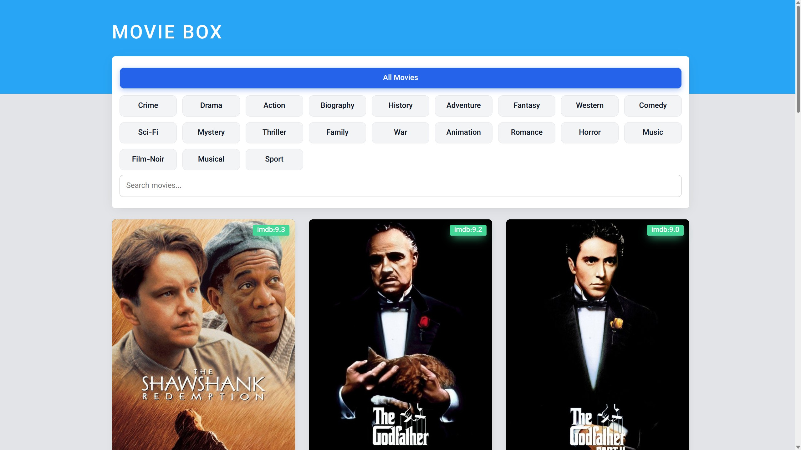
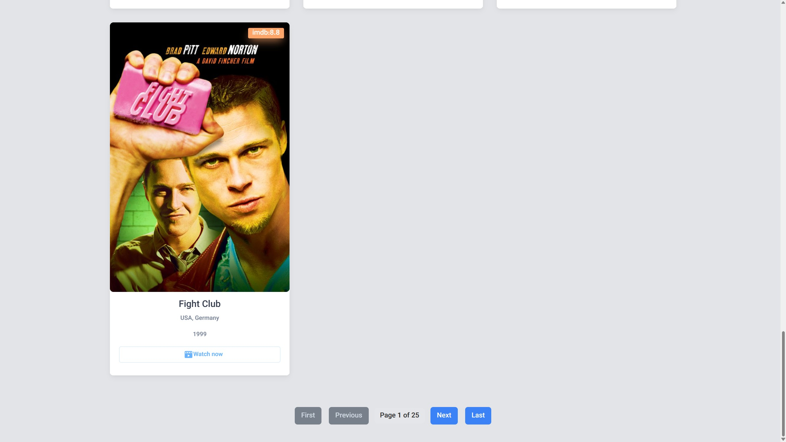

# 🎬 React Movie Browser App

An elegant and fully responsive movie browsing web app built with **React.js**, featuring live search, category filters, pagination, and smooth UX transitions.




---

## 🚀 Features

✅ **Live Search with Debounce**
Search movies in real-time with 400ms debounce to reduce API load and improve UX.

✅ **Genre-Based Filtering (Category Chips)**
Browse by movie genres using interactive chips with smooth hover and active effects.

✅ **Smart Pagination System**
Navigate through pages with intelligent button states (disabled at edges).

✅ **Responsive Poster Cards**
Consistent card layout with `aspect-ratio` handling and title truncation for long names.

✅ **Error & Loading States**
Dynamic UI feedback for empty results, loading states, and network errors.

---

## 🧩 Tech Stack

| Layer           | Tools                                                       |
| --------------- | ----------------------------------------------------------- |
| **Frontend**    | React.js (Hooks, Functional Components)                     |
| **HTTP Client** | Axios                                                       |
| **Styling**     | Custom CSS (Flex + Grid)                                    |
| **Icons**       | React Icons (`react-icons/bs`, `react-icons/md`, etc.)      |
| **Animations**  | CSS transitions + fade-in keyframes                         |
| **API Source**  | [MoviesAPI.ir](https://moviesapi.ir) (sample REST endpoint) |

---

## ⚙️ Project Structure

```
src/
 ├── App.js                # Main logic, data fetching, layout
 ├── CategoryList/         # Genre filter bar (chips)
 ├── SearchBar/            # Debounced search input
 ├── MoviesList/           # Movie card grid
 ├── MovieItem/            # Single movie card
 ├── PageButton/           # Pagination controls
 ├── Loading/              # Loading spinner component
 ├── assets/               # Images, icons, static files
 └── App.css               # Global responsive styles
```

---

## 🧠 Key Improvements (v1.2.0)

* Rebuilt **SearchBar** with debounce, clear button, and animated loader
* Introduced **chip-based category system**
* Fixed inconsistent card sizes with new `.poster-wrapper`
* Added responsive layouts for all screen sizes
* Simplified and unified API calls under a single `fetchMovies()` function

---

## 📦 Installation

Clone the repository and install dependencies:

```bash
git clone https://github.com/your-username/react-movie-browser.git
cd react-movie-browser
npm install
npm start
```

Then open [http://localhost:3000](http://localhost:3000) in your browser.

---

## 🧑‍💻 Development Scripts

| Command         | Description                       |
| --------------- | --------------------------------- |
| `npm start`     | Run in development mode           |
| `npm run build` | Create optimized production build |
| `npm test`      | Run test suite                    |
| `npm run eject` | Expose React configs (optional)   |

---

## 💬 Author

Developed with ❤️ by **[Hamidreza_KZE]**

> Front-end Developer & UI/UX Enthusiast
> GitHub: [@HamidrezaKZE](https://github.com/HamidrezaKZE)
> LinkedIn: [linkedin.com/in/HamidrezaKamalzade](https://www.linkedin.com/in/hamidrezakamalzade/)

---

## 🌟 Show Your Support

If you found this project helpful, please **star ⭐ the repository** and share it with others!

